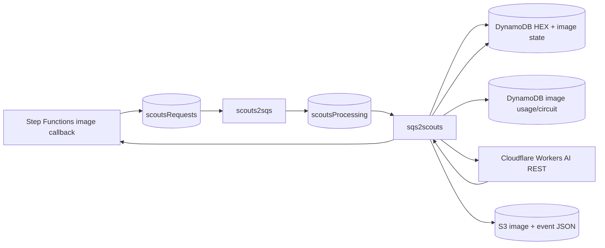

# Cloudflare Workers AI image generation

Scouts uses **Gemini for text enrichment** (`tagline` and `imageTheme`) and can use **Cloudflare Workers AI** for the image stage.

The production-safe target configuration is:

```text
GEMINI=true
GEMINI_IMAGES=false
IMAGE_GENERATION_PROVIDER=cloudflare
IMAGE_GENERATION_DAILY_REQUEST_LIMIT=10
CLOUDFLARE_AI_MODEL=@cf/black-forest-labs/flux-1-schnell
CLOUDFLARE_AI_STEPS=4
```

`IMAGE_GENERATION_PROVIDER=disabled` is the fail-closed default and makes no external image-generation call. `gemini` remains available only as an explicit rollback/testing choice.

> **Do not enable automatic Gemini image fallback.** That would defeat the billing-safety objective of moving image generation away from a billable Gemini image model.

## Credentials

Required runtime configuration:

```text
CLOUDFLARE_ACCOUNT_ID=<Cloudflare account id>
CLOUDFLARE_AI_API_TOKEN_PARAMETER=/scouts/sqs2scouts/cloudflare-ai-api-token
```

The API token itself is stored as an AWS Systems Manager Parameter Store `SecureString`. Only the parameter name is passed through CloudFormation/Lambda configuration.

Use a least-privilege Cloudflare API token that can invoke **Workers AI** for the configured account. Do not use or reuse a Cloudflare Global API Key.

CI can load the token from Bitwarden into `CLOUDFLARE_AI_API_TOKEN`; `lambdas/sqs2scouts/deploy.sh` writes that value to the configured SSM parameter after deployment. The token must never be committed to GitHub or placed in a plaintext CloudFormation parameter.

## Request path



The direct REST endpoint is:

```text
POST https://api.cloudflare.com/client/v4/accounts/<account-id>/ai/run/@cf/black-forest-labs/flux-1-schnell
```

The request includes the existing Scouts image prompt and the configured `steps` value. The response image is decoded from base64, normalised through Sharp, then persisted to the existing event-image location.

## Billing and Free-plan safety

Issue #18 was designed around Cloudflare Workers AI's Free-plan allocation. The important operational assumption is that the account stays on the **Workers Free** plan. On a paid Workers plan, usage above the included allocation can become billable.

The application therefore keeps its own independent daily image request cap. The default is:

```text
IMAGE_GENERATION_DAILY_REQUEST_LIMIT=10
```

A value of `0` means **zero external image calls are permitted**; it does not mean unlimited. To disable image generation intentionally, prefer `IMAGE_GENERATION_PROVIDER=disabled` so the operating state is explicit.

The cap counts **actual external image inference attempts**, not:

- duplicate SQS deliveries;
- cached generation reuse;
- retries that only persist an already-generated image.

The worker first wins the #16 `HEX + stage` conditional reservation, then reserves image budget, then calls Cloudflare. Duplicate deliveries that lose the stage reservation consume no image budget.

## Durable result reuse

A successful generated image is compressed to a bounded JPEG and cached in the enrichment-state record **before final S3/event persistence**.

If image or event persistence fails after a successful Cloudflare inference:

```text
next delivery
  -> matching generationId found
  -> cached JPEG reused
  -> S3/event persistence retried
  -> Cloudflare request count stays unchanged
```

This protects against retry storms consuming the daily allocation.

## Cloudflare quota exhaustion

Cloudflare error `3036` is treated as an account/day-level provider quota condition rather than an event-content failure.

When it occurs:

- no immediate retry is made;
- the event's reserved attempt is rolled back for quota purposes;
- a provider circuit is stored in DynamoDB;
- subsequent automatic image work is blocked until shortly after the next UTC reset;
- one `ProviderQuotaExhausted` metric and operational Slack notification are emitted;
- the event is **not** quarantined merely because the account-wide allocation was exhausted.

Other important mappings:

| Cloudflare response | Treatment |
| --- | --- |
| `429 / 3036` | provider daily quota circuit |
| `429 / 3040` | retryable/cooldown |
| `408`, network timeout/reset | retryable/cooldown |
| `500/502/503/504` | retryable/cooldown |
| `400`, invalid request | deterministic/manual review |
| `401/403` | authentication/permission failure; fail closed |
| `403 / 5035` | paid-plan-required/model configuration fault; fail closed |
| `5007` / `3042` | invalid/nonexistent model; fail closed |

There is **no Cloudflare -> Gemini image fallback** for any of these conditions.

## Metrics and alarms

Image generation uses the `Scouts/ImageGeneration` namespace. Important metrics include:

```text
Requests
ResultReused
QuotaRejected
ProviderQuotaExhausted
Failure
Success
```

CloudFormation alarms cover:

- application daily image cap reached;
- Cloudflare provider daily allocation exhausted;
- image-provider failure burst.

The existing issue #16 retry/quarantine alarms remain in place.

## Safe rollout

1. Deploy with `IMAGE_GENERATION_PROVIDER=disabled`.
2. Confirm Lambda starts and Gemini text enrichment still works.
3. Create/configure the least-privilege Cloudflare Workers AI token in SSM.
4. Set repository/environment configuration to `IMAGE_GENERATION_PROVIDER=cloudflare` and `GEMINI_IMAGES=false`.
5. Trigger one known image enrichment.
6. Confirm exactly one Workers AI inference and the expected S3 image/event update.
7. Repeat the same generation and confirm the cached result is reused with zero extra inference.
8. Force a persistence failure after generation and confirm the cached JPEG is reused.
9. Confirm Gemini image API receives zero calls.
10. Confirm Workers AI usage remains within the intended Free allocation.

## Explicit rollback

Rollback is deliberate, never automatic.

To disable all image generation safely:

```text
IMAGE_GENERATION_PROVIDER=disabled
GEMINI_IMAGES=false
```

To explicitly return image generation to Gemini for a controlled rollback/test:

```text
IMAGE_GENERATION_PROVIDER=gemini
GEMINI_IMAGES=true
```

Only use the second configuration when paid Gemini image usage is intentionally accepted. Existing cached generation IDs are provider-neutral, so a cached successful result should normally be reused rather than regenerated simply because the configured provider changed.
