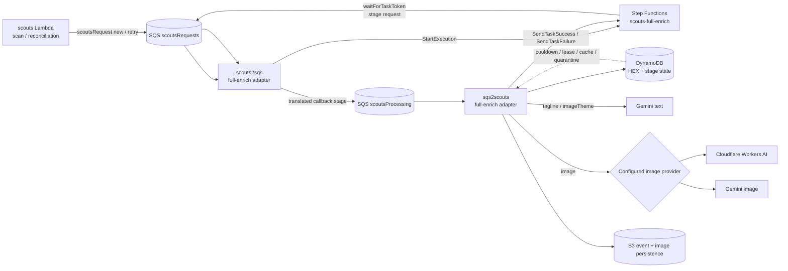

# 2nd Tolworth Scout Group Website

A professional, responsive website for 2nd Tolworth Scout Group with design inspired by the official [Scouts UK website](https://www.scouts.org.uk/).

## 🎨 Recent Updates - Scouts UK Style

This website has been completely redesigned to match the official Scouts UK branding and style guidelines.

### New Features
- ✅ Official Scouts UK color palette and typography
- ✅ Section logos (Beavers, Cubs, Scouts)
- ✅ Animated buttons with hover effects
- ✅ Age range overview section
- ✅ Activities showcase section
- ✅ Modern card-based layouts
- ✅ Yellow primary CTA buttons
- ✅ Enhanced responsive design

## 📁 Files & Structure

### Main Files
- `index.html` - Main website
- `styles.css` - Complete styling
- `component-preview.html` - Preview all UI components

### Images Directory (`/images/`)
- `beavers-logo.svg` - Beavers section logo (teal)
- `cubs-logo.svg` - Cubs section logo (green)
- `scouts-logo.svg` - Scouts section logo (dark teal)
- `scouts-main-logo.svg` - Main Scouts logo

### Booklet
- `2tolworthcub_booklet_html/` - Cub Scout booklet pages

### Documentation
- `website/docs/index.html` - Live technical architecture documentation
- `CLOUDFLARE-IMAGE-GENERATION.md` - Cloudflare Workers AI rollout, billing safety, quota handling and rollback
- `GEMINI-ENRICHMENT-RETRY.md` - Enrichment retry/idempotency safety
- `DESIGN_IMPROVEMENTS.md` - Design overhaul details
- `BUTTONS_AND_IMAGES.md` - Buttons and images guide

## Enrichment architecture

Event enrichment is orchestrated by the `scouts-full-enrich` Standard Step Functions workflow. Step Functions owns sequencing; SQS owns transport; DynamoDB owns retry/idempotency state; `sqs2scouts` owns provider calls and task-token callbacks.



Normal stage progression is:

```text
tagline -> imageTheme -> image -> complete
```

The workflow resumes from the first missing field, so partially enriched events do not regenerate completed stages. Each callback stage is handed from Step Functions to `scoutsRequests`, translated by `scouts2sqs`, forwarded to `scoutsProcessing`, then processed by `sqs2scouts`.

### Retry and cost-safety boundary

- DynamoDB state is keyed by `HEX + stage`.
- A conditional `in_progress` lease ensures only one delivery owns a provider call.
- Duplicate deliveries that see an active reservation are acknowledged without completing the shared Step Functions task token; the reservation owner remains responsible for the callback.
- Provider/global image budget is reserved only after the stage reservation is won.
- Successful generated output is cached before downstream S3 event persistence, so a persistence retry does not call the provider again.
- Retryable failures use the bounded retry/cooldown policy: 1 hour, then 6 hours, then `manual_review` after the third failed attempt.
- Provider/global quota deferrals do not consume a per-event attempt.
- Cloudflare failures never automatically fall back to Gemini.

Target image-provider configuration is deliberately explicit:

```text
GEMINI=true
GEMINI_IMAGES=false
IMAGE_GENERATION_PROVIDER=cloudflare
IMAGE_GENERATION_DAILY_REQUEST_LIMIT=10
```

`IMAGE_GENERATION_PROVIDER=disabled` is the fail-closed default. See `CLOUDFLARE-IMAGE-GENERATION.md` for SSM token setup, Free-vs-Paid billing assumptions, Cloudflare `3036` quota handling, safe rollout and explicit Gemini rollback.

The live website documentation at `/website/docs/index.html` contains a more detailed sequence diagram, provider hand-off explanation, and troubleshooting table.

## Features

- **Responsive Design**: Fully responsive layout that works on desktop, tablet, and mobile devices
- **Section Information**: Dedicated content for Beavers (6-8), Cubs (8-10½), and Scouts (10½-14)
- **News Section**: Display latest updates and announcements
- **Contact Form**: Easy way for interested families to get in touch
- **Official Branding**: Uses official Scouts UK colors and typography
- **Interactive Elements**: Animated buttons, hover effects, and smooth transitions
- **Modern UI**: Clean, professional design matching scouts.org.uk

## 🎯 Sections Include

- Home/Hero section with yellow CTA buttons
- About section with action buttons
- Age range overview (visual section indicators)
- Our Sections (Beavers, Cubs, Scouts) with logos
- Activities showcase (camping, activities, badges)
- Latest News
- Calendar integration
- Contact information and form
- Multi-column footer

## Deployment
- Website, Scouts queues, Scouts Lambdas, and the Scouts-specific Slack handler now deploy from this repo.
- GitHub Actions workflow: `.github/workflows/deploy-to-s3.yml`
- Lambda deployment code and CloudFormation templates live under `lambdas/`.
- Local deployment entrypoint: `./deploy.sh`
- Examples:
  - `./deploy.sh website`
  - `./deploy.sh lambdas`
  - `./deploy.sh all`

## How to Use

### Live Site (S3)

The website is automatically deployed to Amazon S3 and is accessible at:
- **S3 URL**: http://2ntolworth.s3-website.eu-west-2.amazonaws.com

The site is automatically updated whenever changes are pushed to the `master` branch.

### Local Development

Simply open `index.html` in a web browser, or serve it using any web server:

```bash
# Using Python
python3 -m http.server 8000

# Then open http://localhost:8000 in your browser
```

## 🎨 View Components

To see all available buttons, logos, and UI components:
```bash
# Open component-preview.html in your browser
```

## Customization

To customize for your specific scout group:

1. Update the group name in `index.html`
2. Replace logo SVGs with your group's logos (if available)
3. Modify meeting times and locations in the sections
4. Update contact information (email, phone, address)
5. Add your own news items and events
6. Add real photos from group activities
7. Customize colors in `styles.css` if needed

## Technologies

- HTML5
- CSS3
- JavaScript for shared website components and admin/runtime features
- AWS Lambda, SQS, Step Functions, DynamoDB and S3 for event enrichment
- Gemini for text enrichment
- Cloudflare Workers AI or Gemini for explicitly selected image generation

## Event Tagline Compatibility

- Website event rendering and admin views now read both `tagline` and legacy `AI` fields.
- If both fields exist on an event, `tagline` is used.
- Legacy `AI` support is temporary for migration and backward compatibility.
