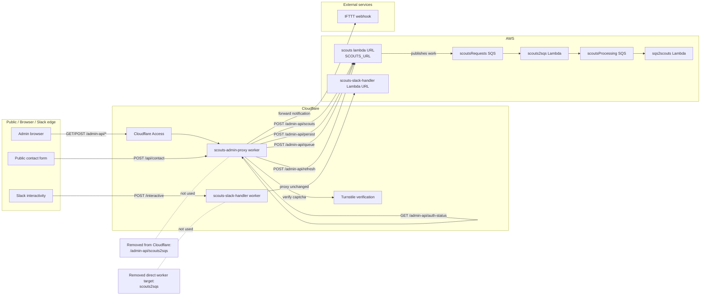

# Scouts Cloudflare Current Architecture

This is the current-state diagram source for the Scouts Cloudflare edge layer.
It reflects the removal of legacy `scouts2sqs` references from the Cloudflare Workers.

## What changed

- `scouts-admin-proxy` no longer exposes or documents `/admin-api/scouts2sqs`
- admin write routes now proxy only to `SCOUTS_URL`
- `scouts-slack-handler` proxies Slack interactivity to the dedicated `scouts-slack-handler` Lambda URL
- queue processing such as `scouts2sqs` remains downstream in AWS, but it is not called directly by either Cloudflare Worker

## Diagram

## Miro Build Notes

Use these boxes if you want to recreate the diagram manually in Miro.

### Column 1

- Admin browser
- Public contact form
- Slack interactivity

### Column 2

- Cloudflare Access
- scouts-admin-proxy worker
- Turnstile verification
- scouts-slack-handler worker

### Column 3

- scouts lambda URL (`SCOUTS_URL`)
- scouts-slack-handler Lambda URL
- scoutsRequests SQS
- scouts2sqs Lambda
- scoutsProcessing SQS
- sqs2scouts Lambda

### Column 4

- IFTTT webhook

## Connectors

- Admin browser -> Cloudflare Access
- Cloudflare Access -> scouts-admin-proxy worker
- scouts-admin-proxy worker -> scouts lambda URL (`POST /admin-api/scouts`)
- scouts-admin-proxy worker -> scouts lambda URL (`POST /admin-api/persist`)
- scouts-admin-proxy worker -> scouts lambda URL (`POST /admin-api/queue`)
- scouts-admin-proxy worker -> scouts lambda URL (`POST /admin-api/refresh`)
- scouts-admin-proxy worker -> scouts-admin-proxy worker (`GET /admin-api/auth-status`)
- Public contact form -> scouts-admin-proxy worker (`POST /api/contact`)
- scouts-admin-proxy worker -> Turnstile verification
- scouts-admin-proxy worker -> IFTTT webhook
- Slack interactivity -> scouts-slack-handler worker
- scouts-slack-handler worker -> scouts-slack-handler Lambda URL
- scouts lambda URL -> scoutsRequests SQS
- scoutsRequests SQS -> scouts2sqs Lambda
- scouts2sqs Lambda -> scoutsProcessing SQS
- scoutsProcessing SQS -> sqs2scouts Lambda

## Explicit removals to show on the board

- Cross out or omit `/admin-api/scouts2sqs`
- Cross out or omit any direct Cloudflare Worker -> `scouts2sqs` connector
- Keep `scouts2sqs` only in the downstream AWS queue-processing lane
