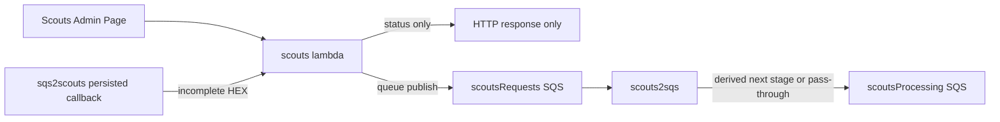

# Scouts Admin To Lambda, `scoutsRequests`, And `scouts2sqs` Mapping

This maps:

- what the Scouts admin page sends
- what the `scouts` lambda matches and publishes to `scoutsRequests`
- how `scouts2sqs` transforms those messages before publishing to `scoutsProcessing`

The current source of truth is the code, not the older board diagram.

## Scope

- Source UI: `scouts/website/admin/admin-script.js`
- Admin button action values: `scouts/website/admin/index.html`
- Lambda: `lambdas/scouts/function/scouts.mjs`
- Queue consumer / transformer: `lambdas/scouts/sqs/scouts2sqs/function/scouts2sqs.mjs`

## High-level flow

## Admin to `scoutsRequests` to `scouts2sqs`

| Admin page action | Admin payload sent to `scouts` | Message published to `scoutsRequests` | `scouts2sqs` result | Notes |
| --- | --- | --- | --- | --- |
| Runtime status poll | `realm: 'scouts'`, `subject: 'status'`, `action: 'runtime'` | None | None | Returns runtime state only. |
| Agenda refresh | `realm: 'scouts'`, `subject: 'agenda'`, `action: <number>`, `maxEvents` | Indirect only: `realm: 'scoutsRequest'`, `action: 'new'`, `subject: <merged event object>` | Derives next stage from completeness: `tagline/request`, `imageTheme/request`, `image/request`, or no publish | Queue work is created by enrichment logic, not by a 1:1 admin command translation. |
| Auto heartbeat | `realm: 'scouts'`, `subject: 'agenda'`, `action: 0`, `maxEvents: 0` | Same as agenda refresh | Same as agenda refresh | Same enrichment path as manual agenda refresh. |
| Calendar refresh | `realm: 'scouts'`, `subject: '<calendar token>'` or `'calendars'`, `action: 'refreshCalendars'` or another refresh token | Indirect only: `realm: 'scoutsRequest'`, `action: 'new'`, `subject: <merged event object>` | Derives next stage from completeness: `tagline/request`, `imageTheme/request`, `image/request`, or no publish | Selected feed token comes from the admin button value and subject token. |
| Persist tagline | `realm: 'scouts'`, `subject: { hexId, tagline }`, `action: 'persistTagline'` or targeted `persist` | `realm: 'scoutsRequest'`, `action: 'persist'`, `subject: 'tagline'`, `hexId`, `tagline` | Translated by `scouts2sqs` to `persist/persist` with object subject | `scoutsQueued` keeps the field-level external contract; downstream queues keep the translated internal contract. |
| Persist image theme | `realm: 'scouts'`, `subject: { hexId, imageTheme }`, `action: 'persistImageTheme'` or targeted `persist` | `realm: 'scoutsRequest'`, `action: 'persist'`, `subject: 'imageTheme'`, `hexId`, `imageTheme` | Translated by `scouts2sqs` to `persist/persist` with object subject | `imageTheme` remains the internal field name in the current flow. |
| Persist image URL | `realm: 'scouts'`, `subject: { hexId, imageUrl }`, `action: 'persistImageUrl'` or targeted `persist` | `realm: 'scoutsRequest'`, `action: 'persist'`, `subject: 'imageUrl'`, `hexId`, `imageUrl` | Translated by `scouts2sqs` to `persist/persist` with object subject | URL validation still happens in `scouts` before queueing. |
| Generate tagline | `realm: 'scouts'`, `subject: { hexId }`, `action: 'generateTagline'` | `realm: 'scoutsRequest'`, `action: 'request'`, `subject: 'tagline'`, `hexId` | Translated by `scouts2sqs` to `tagline/request` with hex subject | The admin button still passes the field-specific action token; the queue boundary now uses the external field-level contract. |
| Generate image theme | `realm: 'scouts'`, `subject: { hexId }`, `action: 'generateImageTheme'` | `realm: 'scoutsRequest'`, `action: 'request'`, `subject: 'imageTheme'`, `hexId` | Translated by `scouts2sqs` to `imageTheme/request` with hex subject | Current flow uses `imageTheme`, not `imagePrompt` or `pixabay`. |
| Generate image | `realm: 'scouts'`, `subject: { hexId }`, `action: 'generateImage'` | `realm: 'scoutsRequest'`, `action: 'request'`, `subject: 'imageUrl'`, `hexId` | Translated by `scouts2sqs` to `image/request` with hex subject | The external contract now normalizes the field name as `imageUrl` while the internal processing realm remains `image`. |
| Hide event | `realm: 'scouts'`, `subject: { hexId, isHidden: true }`, `action: 'hide'` | `realm: 'persist'`, `action: 'persist'`, `subject: { hexId, isHidden: true }` | Forwarded to `scoutsProcessing` as `persist/persist` | Current admin hide no longer publishes `persist/hidden`. |
| Unhide event | `realm: 'scouts'`, `subject: { hexId, isHidden: false }`, `action: 'unhide'` | `realm: 'persist'`, `action: 'persist'`, `subject: { hexId, isHidden: false }` | Forwarded to `scoutsProcessing` as `persist/persist` | Same queue shape as hide, with `isHidden: false`. |
| Requeue incomplete event | `realm: 'scouts'`, `subject: 'scoutsRequest'`, `action: 'requeue'`, `event: <normalized event>` | `realm: 'scoutsRequest'`, `action: 'new'`, `subject: <normalized event>` | Derives next stage from completeness: `tagline/request`, `imageTheme/request`, `image/request`, or no publish | The event object is normalized before queueing. |

## Additional non-admin producers of `scoutsRequests`

These are not sent directly by the admin page, but they affect the real pipeline and should be represented in diagrams that aim to document the queue flow.

| Producer | Message published to `scoutsRequests` | `scouts2sqs` result | Notes |
| --- | --- | --- | --- |
| Enrichment run finds new or stale work | `realm: 'scoutsRequest'`, `action: 'new'`, `subject: <merged event object>` | Derives `tagline/request`, `imageTheme/request`, `image/request`, or no publish | Used by agenda/calendar processing and retry handling. |
| Broken image repair | `realm: 'scoutsRequest'`, `action: 'repair'`, `subject: <event object>` | Derives `tagline/request`, `imageTheme/request`, `image/request`, or no publish | Repair goes through the same completeness logic in `scouts2sqs`. |
| Reset cleanup notification | `realm: 'scouts'`, `subject: 'reset'`, `action: <removed-events summary>` | Dropped by `scouts2sqs` | `scouts2sqs` does not support the `scouts` realm on the SQS path. |
| `sqs2scouts` callback for incomplete persisted HEX | `realm: 'scoutsRequest'`, `action: 'new'`, `subject: <hex data>` | Derives `tagline/request`, `imageTheme/request`, `image/request`, or no publish | This happens when persisted data is still incomplete. |

## Important translations

### 1. Admin metadata commands now use structured `subject` objects

The older flow used token-like subjects such as `tagline`, `imagePrompt`, `imageUrl`, or `metadata`.

The current admin page sends payloads like:

- `realm: 'scouts'`
- `subject: { hexId, tagline }`
- `subject: { hexId, imageTheme }`
- `subject: { hexId, imageUrl }`
- `subject: { hexId }` for generate actions
- `subject: { hexId, isHidden: true|false }` for hide/unhide
- `subject: 'scoutsRequest', event: <normalized event>` for requeue

The `scouts` lambda then translates those admin requests into queue-specific payloads.

### 2. Hide and unhide now publish `persist/persist`

Current hide and unhide requests are both translated to:

- `realm: 'persist'`
- `action: 'persist'`
- `subject: { hexId, isHidden: true|false }`

That is a meaningful change from the older `persist/hidden` hide path.

### 3. Current queue stage names are `tagline`, `imageTheme`, and `image`

For the current admin and `scoutsRequest` flows, the active downstream stages are:

- `tagline`
- `imageTheme`
- `image`

`imagePrompt`, `AI`, and other legacy names still appear in compatibility code, but they are not the primary names the current admin flow emits.

### 4. `scouts2sqs` derives the next stage from subject completeness

For `realm: 'scoutsRequest'` with `action: 'new' | 'retry' | 'repair'`, `scouts2sqs` checks the subject in this order:

1. missing tagline -> publish `tagline / request / <hex>`
2. missing `image.theme` -> publish `imageTheme / request / <hex>`
3. missing `image.url` -> publish `image / request / <hex>`
4. fully populated -> do not publish another processing request

### 5. `persist` is a pass-through realm in `scouts2sqs`

Messages already published to `scoutsRequests` as `realm: 'persist'` are forwarded onward by `scouts2sqs` to `scoutsProcessing` rather than being re-derived from completeness.

### 6. Queue publishing strips stable identifiers from object subjects

Before any payload is sent to `scoutsRequests`, `postToScoutsRequestsQueue()` clones the payload and removes:

- `subject.uid`
- `subject.originalUid`

So queue payloads are normalized copies, not exact object echoes from the admin page or internal event objects.

## File references

- Admin runtime poll helper: `/Users/antoniofreire/storage/github/scouts/website/admin/admin-script.js:1029`
- Admin agenda refresh payload: `/Users/antoniofreire/storage/github/scouts/website/admin/admin-script.js:2478`
- Admin calendar refresh helper: `/Users/antoniofreire/storage/github/scouts/website/admin/admin-script.js:2536`
- Admin field config and active subject keys: `/Users/antoniofreire/storage/github/scouts/website/admin/admin-script.js:2630`
- Admin persist helper: `/Users/antoniofreire/storage/github/scouts/website/admin/admin-script.js:2805`
- Admin generate helper: `/Users/antoniofreire/storage/github/scouts/website/admin/admin-script.js:2885`
- Admin hide helper: `/Users/antoniofreire/storage/github/scouts/website/admin/admin-script.js:2948`
- Admin unhide helper: `/Users/antoniofreire/storage/github/scouts/website/admin/admin-script.js:3041`
- Admin requeue helper: `/Users/antoniofreire/storage/github/scouts/website/admin/admin-script.js:3149`
- Admin button action tokens: `/Users/antoniofreire/storage/github/scouts/website/admin/index.html:283`
- Queue publisher and identifier stripping: `/Users/antoniofreire/storage/github/lambdas/scouts/function/scouts.mjs:1310`
- Reset notification producer: `/Users/antoniofreire/storage/github/lambdas/scouts/function/scouts.mjs:1355`
- Broken image repair producer: `/Users/antoniofreire/storage/github/lambdas/scouts/function/scouts.mjs:2234`
- Enrichment new/retry queue emission: `/Users/antoniofreire/storage/github/lambdas/scouts/function/scouts.mjs:2470`
- Metadata persist translation: `/Users/antoniofreire/storage/github/lambdas/scouts/function/scouts.mjs:3066`
- Hide/unhide translation: `/Users/antoniofreire/storage/github/lambdas/scouts/function/scouts.mjs:3233`
- Generate translation: `/Users/antoniofreire/storage/github/lambdas/scouts/function/scouts.mjs:3309`
- `sqs2scouts` incomplete callback handling: `/Users/antoniofreire/storage/github/lambdas/scouts/function/scouts.mjs:3459`
- `scouts2sqs` allowed realms: `/Users/antoniofreire/storage/github/lambdas/scouts/sqs/scouts2sqs/function/scouts2sqs.mjs:1592`
- `scouts2sqs` Slack relay path: `/Users/antoniofreire/storage/github/lambdas/scouts/sqs/scouts2sqs/function/scouts2sqs.mjs:1707`
- `scouts2sqs` `scoutsRequest` transformation path: `/Users/antoniofreire/storage/github/lambdas/scouts/sqs/scouts2sqs/function/scouts2sqs.mjs:1780`