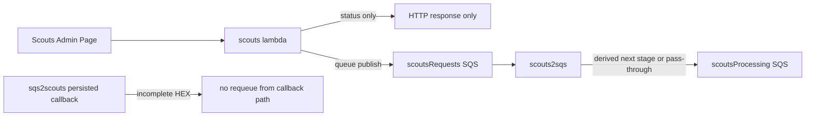

# Scouts Admin To Lambda, `scoutsRequests`, And `scouts2sqs` Mapping

This maps:

- what the Scouts admin page sends
- what the `scouts` lambda matches and publishes to `scoutsRequests`
- how `scouts2sqs` transforms those messages before publishing to `scoutsProcessing`

The current source of truth is the code, not the older board diagram.

## Scope

- Source UI: `website/admin/admin-script.js`
- Admin button action values: `website/admin/index.html`
- Lambda: `lambdas/scouts/function/scouts.mjs`
- Queue consumer / transformer: `lambdas/scouts2sqs/function/request-processor.mjs`

## High-level flow

## Admin to `scoutsRequests` to `scouts2sqs`

| Admin page action | Admin payload sent to `scouts` | Message published to `scoutsRequests` | `scouts2sqs` result | Notes |
| --- | --- | --- | --- | --- |
| Runtime status poll | `realm: 'scouts'`, `subject: 'status'`, `action: 'runtime'` | None | None | Returns runtime state only. |
| Agenda refresh | `realm: 'scouts'`, `subject: 'agenda'`, `action: <number>`, `maxEvents` | Indirect only: `realm: 'scoutsRequest'`, `action: 'new'`, `subject: <merged event object>` | Starts the canonical full-enrich workflow at `taglineTheme` when both text fields are missing, otherwise at the single missing field or image stage | New events use one combined Gemini text request rather than separate tagline and image-theme calls. |
| Auto heartbeat | `realm: 'scouts'`, `subject: 'agenda'`, `action: 0`, `maxEvents: 0` | Same as agenda refresh | Same as agenda refresh | Same enrichment path as manual agenda refresh. |
| Calendar refresh | `realm: 'scouts'`, `subject: '<calendar token>'` or `'calendars'`, `action: 'refreshCalendars'` or another refresh token | Indirect only: `realm: 'scoutsRequest'`, `action: 'new'`, `subject: <merged event object>` | Starts the canonical full-enrich workflow at the first required stage | Selected feed token comes from the admin button value and subject token. |
| Persist tagline | `realm: 'scouts'`, `subject: { hex, tagline }`, `action: 'persistTagline'` or targeted `persist` | `realm: 'scoutsRequest'`, `action: 'persist'`, `subject: 'tagline'`, `hex`, `tagline` | Translated to `persist/persist` with `subject.metadata.hex` + `subject.metadata.tagline` | Canonical nesting prevents normalization from restoring the previous tagline. Legacy top-level queued patches remain supported. |
| Persist image theme | `realm: 'scouts'`, `subject: { hex, imageTheme }`, `action: 'persistImageTheme'` or targeted `persist` | `realm: 'scoutsRequest'`, `action: 'persist'`, `subject: 'imageTheme'`, `hex`, `imageTheme` | Translated to `persist/persist` with `subject.metadata.image.theme` | The queue-facing field name stays `imageTheme`; the persistence boundary uses the canonical metadata shape. |
| Persist image URL | `realm: 'scouts'`, `subject: { hex, imageUrl }`, `action: 'persistImageUrl'` or targeted `persist` | `realm: 'scoutsRequest'`, `action: 'persist'`, `subject: 'imageUrl'`, `hex`, `imageUrl` | Translated to `persist/persist` with `subject.metadata.image.url` | URL validation still happens in `scouts` before queueing. |
| Generate tagline | `realm: 'scouts'`, `subject: { hex }`, `action: 'generateTagline'` | `realm: 'scoutsRequest'`, `action: 'request'`, `subject: 'tagline'`, `hex` | Intercepted into a fresh manual full-enrich execution at `tagline`; the stage callback becomes `tagline/request` | Stops after tagline and preserves image theme/image. |
| Generate image theme | `realm: 'scouts'`, `subject: { hex }`, `action: 'generateImageTheme'` | `realm: 'scoutsRequest'`, `action: 'request'`, `subject: 'imageTheme'`, `hex` | Intercepted into a fresh manual full-enrich execution at `imageTheme`; the stage callback becomes `imageTheme/request` | Stops after image theme and preserves tagline/image. |
| Generate image | `realm: 'scouts'`, `subject: { hex }`, `action: 'generateImage'` | `realm: 'scoutsRequest'`, `action: 'request'`, `subject: 'imageUrl'`, `hex` | Translated by `scouts2sqs` to `image/request` with hex subject | The external contract uses `imageUrl` while the internal processing realm remains `image`. |
| Hide event | `realm: 'scouts'`, `subject: { hex, isHidden: true }`, `action: 'hide'` | `realm: 'persist'`, `action: 'persist'`, `subject: { hex, isHidden: true }` | Forwarded to `scoutsProcessing` as `persist/persist` | Current admin hide no longer publishes `persist/hidden`. |
| Unhide event | `realm: 'scouts'`, `subject: { hex, isHidden: false }`, `action: 'unhide'` | `realm: 'persist'`, `action: 'persist'`, `subject: { hex, isHidden: false }` | Forwarded to `scoutsProcessing` as `persist/persist` | Same queue shape as hide, with `isHidden: false`. |

## Additional non-admin producers of `scoutsRequests`

These are not sent directly by the admin page, but they affect the real pipeline and should be represented in diagrams that aim to document the queue flow.

| Producer | Message published to `scoutsRequests` | `scouts2sqs` result | Notes |
| --- | --- | --- | --- |
| Enrichment run finds new or stale work | `realm: 'scoutsRequest'`, `action: 'new'`, `subject: <merged event object>` | Starts the canonical full-enrich workflow at `taglineTheme` when both text fields are absent, otherwise at the single missing text field or image stage | Used by agenda/calendar processing and retry handling. |
| Reset cleanup notification | `realm: 'scouts'`, `subject: 'reset'`, `action: <removed-events summary>` | Dropped by `scouts2sqs` | `scouts2sqs` does not support the `scouts` realm on the SQS path. |
| `sqs2scouts` callback for incomplete persisted HEX | No outbound queue message | No downstream queue work is emitted from this callback path | Persisted-but-incomplete HEX is logged and left in place. |

## Important translations

### 1. Admin metadata commands now use structured `subject` objects

The older flow used token-like subjects such as `tagline`, `imageUrl`, or `metadata`.

The current admin page sends payloads like:

- `realm: 'scouts'`
- `subject: { hex, tagline }`
- `subject: { hex, imageTheme }`
- `subject: { hex, imageUrl }`
- `subject: { hex }` for generate actions
- `subject: { hex, isHidden: true|false }` for hide/unhide

The `scouts` lambda then translates those admin requests into queue-specific payloads.

### 2. Hide and unhide now publish `persist/persist`

Current hide and unhide requests are both translated to:

- `realm: 'persist'`
- `action: 'persist'`
- `subject: { hex, isHidden: true|false }`

That is a meaningful change from the older `persist/hidden` hide path.

### 3. Current queue stage names include the combined `taglineTheme` stage

For the current admin and `scoutsRequest` flows, the active downstream stages are:

- `taglineTheme` — automatic combined tagline + image-theme generation
- `tagline` — field-specific generation
- `imageTheme` — field-specific generation
- `image`

The active admin flow emits `tagline`, `imageTheme`, `imageUrl`, and `hex`.

### 4. `scouts2sqs` derives the next stage from subject completeness

For `realm: 'scoutsRequest'` with `action: 'new' | 'retry'`, the router starts the canonical state machine from persisted completeness:

1. tagline and `image.theme` both missing -> `taglineTheme` (one Gemini call for both)
2. only tagline missing -> `tagline`
3. only `image.theme` missing -> `imageTheme`
4. text complete but `image.url` missing -> `image`
5. fully populated -> no provider work

### 5. `persist` is a pass-through realm in `scouts2sqs`

Messages already published to `scoutsRequests` as `realm: 'persist'` are forwarded onward by `scouts2sqs` to `scoutsProcessing` rather than being re-derived from completeness.

### 6. Queue publishing strips stable identifiers from object subjects

Before any payload is sent to `scoutsRequests`, `postToScoutsRequestsQueue()` clones the payload and removes:

- `subject.uid`
- `subject.originalUid`

So queue payloads are normalized copies, not exact object echoes from the admin page or internal event objects.

## File references

All references below are repository-relative:

- Admin runtime poll helper: `website/admin/admin-script.js:1029`
- Admin agenda refresh payload: `website/admin/admin-script.js:2478`
- Admin calendar refresh helper: `website/admin/admin-script.js:2536`
- Admin field config and active subject keys: `website/admin/admin-script.js:2630`
- Admin persist helper: `website/admin/admin-script.js:2805`
- Admin generate helper: `website/admin/admin-script.js:2885`
- Admin hide helper: `website/admin/admin-script.js:2948`
- Admin unhide helper: `website/admin/admin-script.js:3041`
- Admin button action tokens: `website/admin/index.html:283`
- Queue publisher and identifier stripping: `lambdas/scouts/function/scouts.mjs:1310`
- Reset notification producer: `lambdas/scouts/function/scouts.mjs:1355`
- Enrichment new/retry queue emission: `lambdas/scouts/function/scouts.mjs:2470`
- Metadata persist translation: `lambdas/scouts/function/scouts.mjs:3066`
- Hide/unhide translation: `lambdas/scouts/function/scouts.mjs:3233`
- Generate translation: `lambdas/scouts/function/scouts.mjs:3309`
- `sqs2scouts` incomplete callback handling: `lambdas/scouts/function/scouts.mjs:3459`
- `scouts2sqs` realm validation and pass-through translation: `lambdas/scouts2sqs/function/request-processor.mjs` (`buildQueuePayload` and the SQS branch of `lambdaHandler`)
- `scouts2sqs` Slack metadata forwarding: `lambdas/scouts2sqs/function/request-processor.mjs` (`lambdaHandler`)
- `scouts2sqs` `scoutsRequest` transformation: `lambdas/scouts2sqs/function/request-processor.mjs` (`lambdaHandler`)
