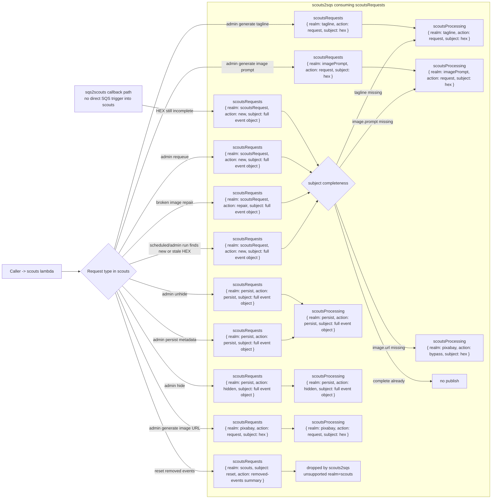

# Scouts Request Pipeline

This document maps:

1. requests received by `scouts`
2. messages published by `scouts` to `scoutsRequests`
3. how `scouts2sqs` consumes those messages and republishes to `scoutsProcessing`

The current source of truth is the Lambda code, not the older flow notes.

## Queue wiring

- `scouts` can send to `scoutsRequests`: `lambdas/cloudformation/templates/scouts.yaml`
- `scouts2sqs` is triggered by `scoutsRequests` and can send to `scoutsProcessing`: `lambdas/cloudformation/templates/scouts2sqs.yaml`
- `sqs2scouts` is triggered by `scoutsProcessing`: `lambdas/cloudformation/templates/sqs2scouts.yaml`
- `scoutsDecision` is not a trigger for `scouts`. Keep `scoutsDecision -> scouts` unmapped to avoid feedback loops.

## Diagram

## Scouts input to scoutsRequests mapping

| `scouts` input case | Condition in `scouts.mjs` | Message published to `scoutsRequests` |
| --- | --- | --- |
| Scheduled or admin run finds a new event needing enrichment | Event processing collects a new HEX notification | `{ realm: "scoutsRequest", action: "new", subject: <full event object> }` |
| Scheduled or admin run finds a stale threshold event | Retry path for stuck HEX files | `{ realm: "scoutsRequest", action: "new", subject: <full event object> }` |
| Broken image repair | Broken image detected in agenda or HEX files | `{ realm: "scoutsRequest", action: "repair", subject: <full event object> }` |
| Admin requeue | `realm=scouts`, `action=requeue` | `{ realm: "scoutsRequest", action: "new", subject: <full event object> }` |
| Admin persist metadata | `realm=scouts`, `action=persist` | `{ realm: "persist", action: "persist", subject: <full event object> }` |
| Admin hide | `realm=scouts`, `action=hide|hidden` | `{ realm: "persist", action: "hidden", subject: <full event object> }` |
| Admin unhide | `realm=scouts`, `action=unhide|show` | `{ realm: "persist", action: "persist", subject: <full event object> }` |
| Admin generate tagline | `realm=scouts`, `action=generate|request`, subject token resolves to `tagline` | `{ realm: "tagline", action: "request", subject: <hex> }` |
| Admin generate image prompt | `realm=scouts`, `action=generate|request`, subject token resolves to `imagePrompt` | `{ realm: "imagePrompt", action: "request", subject: <hex> }` |
| Admin generate image URL | `realm=scouts`, `action=generate|request`, subject token resolves to `imageUrl` | `{ realm: "pixabay", action: "request", subject: <hex> }` |
| Reset cleanup notification | Reset flow removes event files | `{ realm: "scouts", subject: "reset", action: <removed-events summary> }` |
| `sqs2scouts` callback for incomplete persisted HEX | `realm=sqs2scouts`, `action=persisted`, HEX still incomplete | `{ realm: "scoutsRequest", action: "new", subject: <full event object> }` |

## scouts2sqs mapping from scoutsRequests to scoutsProcessing

| Consumed from `scoutsRequests` | `scouts2sqs` behavior | Published to `scoutsProcessing` |
| --- | --- | --- |
| `{ realm: "scoutsRequest", action: "new|retry|repair", subject: <full event object> }` and no tagline | Derives missing stage from subject completeness | `{ realm: "tagline", action: "request", subject: <hex> }` |
| `{ realm: "scoutsRequest", action: "new|retry|repair", subject: <full event object> }` and tagline exists but `image.prompt` missing | Derives missing stage from subject completeness | `{ realm: "imagePrompt", action: "request", subject: <hex> }` |
| `{ realm: "scoutsRequest", action: "new|retry|repair", subject: <full event object> }` and tagline plus prompt exist but `image.url` missing | Derives missing stage from subject completeness | `{ realm: "pixabay", action: "bypass", subject: <hex> }` |
| `{ realm: "scoutsRequest", action: "new|retry|repair", subject: <full event object> }` and subject is already complete | Stops | no publish |
| `{ realm: "persist", action: "persist", subject: <full event object> }` | Allowed realm pass-through | same payload to `scoutsProcessing` |
| `{ realm: "persist", action: "hidden", subject: <full event object> }` | Allowed realm pass-through | same payload to `scoutsProcessing` |
| `{ realm: "tagline", action: "request", subject: <hex> }` | Allowed realm pass-through | same payload to `scoutsProcessing` |
| `{ realm: "imagePrompt", action: "request", subject: <hex> }` | Allowed realm pass-through | same payload to `scoutsProcessing` |
| `{ realm: "pixabay", action: "request", subject: <hex> }` | Allowed realm pass-through | same payload to `scoutsProcessing` |
| `{ realm: "scouts", subject: "reset", action: <removed-events summary> }` | Unsupported realm | dropped |

## Relevant source locations

- `lambdas/cloudformation/templates/scouts.yaml`
- `lambdas/cloudformation/templates/scouts2sqs.yaml`
- `lambdas/cloudformation/templates/sqs2scouts.yaml`
- `lambdas/scouts/function/scouts.mjs`
- `lambdas/scouts/sqs/scouts2sqs/function/scouts2sqs.mjs`

## Guardrail

Never add a Lambda event source mapping from `scoutsDecision` to `scouts`.

Allowed queue triggers:
- `scoutsRequests -> scouts2sqs`
- `scoutsProcessing -> sqs2scouts`

Disallowed trigger:
- `scoutsDecision -> scouts`

`scoutsDecision` may still be used as a notification queue for auditing or external consumers, but not as an automatic input back into `scouts`.
