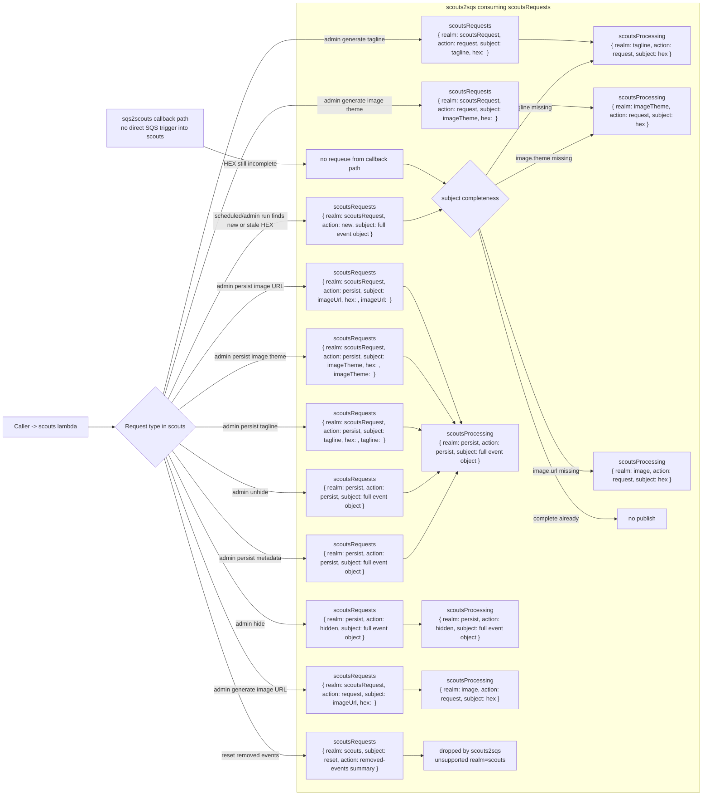
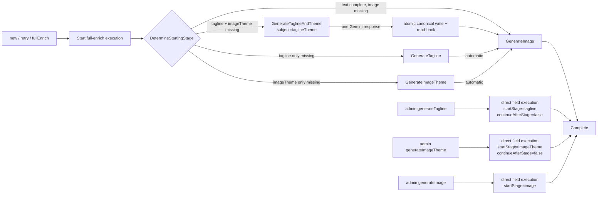

# Scouts Request Pipeline

This document maps:

1. requests received by `scouts`
2. messages published by `scouts` to `scoutsRequests`
3. how `scouts2sqs` consumes those messages and republishes to `scoutsProcessing`

The current source of truth is the Lambda code, not the older flow notes.

## Queue wiring

- `scouts` can send to `scoutsRequests`: `lambdas/cloudformation/templates/scouts.yaml`
- `scouts2sqs` is triggered by `scoutsRequests` and can send to `scoutsProcessing`: `lambdas/cloudformation/templates/scouts2sqs.yaml`
- `sqs2scouts` is triggered by `scoutsProcessing`: `lambdas/cloudformation/templates/sqs2scouts.yaml`
- `scoutsDecision` is not a trigger for `scouts`. Keep `scoutsDecision -> scouts` unmapped to avoid feedback loops.

## Diagram

## Scouts input to scoutsRequests mapping

| `scouts` input case | Condition in `scouts.mjs` | Message published to `scoutsRequests` |
| --- | --- | --- |
| Scheduled or admin run finds a new event needing enrichment | Event processing collects a new HEX notification | `{ realm: "scoutsRequest", action: "new", subject: <full event object> }` |
| Scheduled or admin run finds a stale threshold event | Retry path for stuck HEX files | `{ realm: "scoutsRequest", action: "new", subject: <full event object> }` |
| Admin persist metadata | `realm=scouts`, `action=persist` | `{ realm: "persist", action: "persist", subject: <full event object> }` |
| Admin hide | `realm=scouts`, `action=hide|hidden` | `{ realm: "persist", action: "hidden", subject: <full event object> }` |
| Admin unhide | `realm=scouts`, `action=unhide|show` | `{ realm: "persist", action: "persist", subject: <full event object> }` |
| Admin persist tagline | `realm=scouts`, `action=persistTagline|persist`, subject token resolves to `tagline` | `{ realm: "scoutsRequest", action: "persist", subject: "tagline", hex: <hex>, tagline: <value> }` |
| Admin persist image theme | `realm=scouts`, `action=persistImageTheme|persist`, subject token resolves to `imageTheme` | `{ realm: "scoutsRequest", action: "persist", subject: "imageTheme", hex: <hex>, imageTheme: <value> }` |
| Admin persist image URL | `realm=scouts`, `action=persistImageUrl|persist`, subject token resolves to `imageUrl` | `{ realm: "scoutsRequest", action: "persist", subject: "imageUrl", hex: <hex>, imageUrl: <value> }` |
| Admin generate tagline | `realm=scouts`, `action=generate|request`, subject token resolves to `tagline` | `{ realm: "scoutsRequest", action: "request", subject: "tagline", hex: <hex> }` |
| Admin generate image theme | `realm=scouts`, `action=generate|request`, subject token resolves to `imageTheme` | `{ realm: "scoutsRequest", action: "request", subject: "imageTheme", hex: <hex> }` |
| Admin generate image URL | `realm=scouts`, `action=generate|request`, subject token resolves to `imageUrl` | `{ realm: "scoutsRequest", action: "request", subject: "imageUrl", hex: <hex> }` |
| Reset cleanup notification | Reset flow removes event files | `{ realm: "scouts", subject: "reset", action: <removed-events summary> }` |
| `sqs2scouts` callback for incomplete persisted HEX | `realm=sqs2scouts`, `action=persisted`, HEX still incomplete | No requeue from callback path |

## scouts2sqs / full-enrich orchestration

Generation requests are now intercepted by `request-router.mjs` and owned by the canonical full-enrich Step Function. Stage tasks are sent back through `scoutsRequests` with `orchestrationType=fullEnrich`; `scouts2sqs` translates those stage callbacks to `scoutsProcessing`.

| Consumed from `scoutsRequests` | Router / Step Function behavior | Published stage work |
| --- | --- | --- |
| `{ realm: "scoutsRequest", action: "new|retry|fullEnrich|imageEnrich", ... }` with tagline and theme both missing | Starts full-enrich at `taglineTheme` | `{ realm: "taglineTheme", action: "request", subject: <hex>, orchestrationType: "fullEnrich" }` |
| Same start request with only tagline missing | Starts at `tagline` | `{ realm: "tagline", action: "request", subject: <hex>, orchestrationType: "fullEnrich" }` |
| Same start request with only image theme missing | Starts at `imageTheme` | `{ realm: "imageTheme", action: "request", subject: <hex>, orchestrationType: "fullEnrich" }` |
| Same start request with text complete but image missing | Starts at `image` | `{ realm: "image", action: "request", subject: <hex>, orchestrationType: "fullEnrich" }` |
| Same start request with all generated fields present | Completes without provider work | none |
| `{ realm: "scoutsRequest", action: "request", subject: "tagline", hex: <hex> }` | Starts a fresh manual field execution at `tagline`, with `continueAfterStage=false` | tagline stage only |
| `{ realm: "scoutsRequest", action: "request", subject: "imageTheme", hex: <hex> }` | Starts a fresh manual field execution at `imageTheme`, with `continueAfterStage=false` | image-theme stage only |
| `{ realm: "scoutsRequest", action: "request", subject: "imageUrl", hex: <hex> }` | Starts a fresh manual field execution at `image` | image stage only |
| `{ realm: "scoutsRequest", action: "persist", ... }` or compact `realm=persist` | Translates to the sparse persistence contract | `realm=persist` work on `scoutsProcessing` |

The combined `taglineTheme` task produces and validates both structured fields from one Gemini text request. The worker performs one canonical event write, reads both fields back, then marks the tagline state (combined attempt owner) and image-theme state succeeded before the Step Function advances to image generation.

## Note on `imageTheme`

- `imageTheme` is the stored field on the event metadata.
- Image generation derives a concrete prompt from the stored theme before calling Gemini image generation.
| `{ realm: "scouts", subject: "reset", action: <removed-events summary> }` | Unsupported realm | dropped |

## Relevant source locations

- `lambdas/cloudformation/templates/scouts.yaml`
- `lambdas/cloudformation/templates/scouts2sqs.yaml`
- `lambdas/cloudformation/templates/sqs2scouts.yaml`
- `lambdas/scouts/function/scouts.mjs`
- `lambdas/scouts/sqs/scouts2sqs/function/scouts2sqs.mjs`

## Guardrail

Never add a Lambda event source mapping from `scoutsDecision` to `scouts`.

Allowed queue triggers:
- `scoutsRequests -> scouts2sqs`
- `scoutsProcessing -> sqs2scouts`

Disallowed trigger:
- `scoutsDecision -> scouts`

`scoutsDecision` may still be used as a notification queue for auditing or external consumers, but not as an automatic input back into `scouts`.
